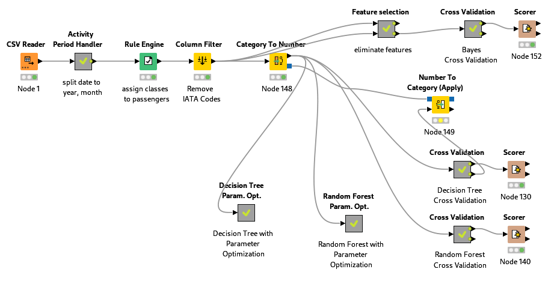
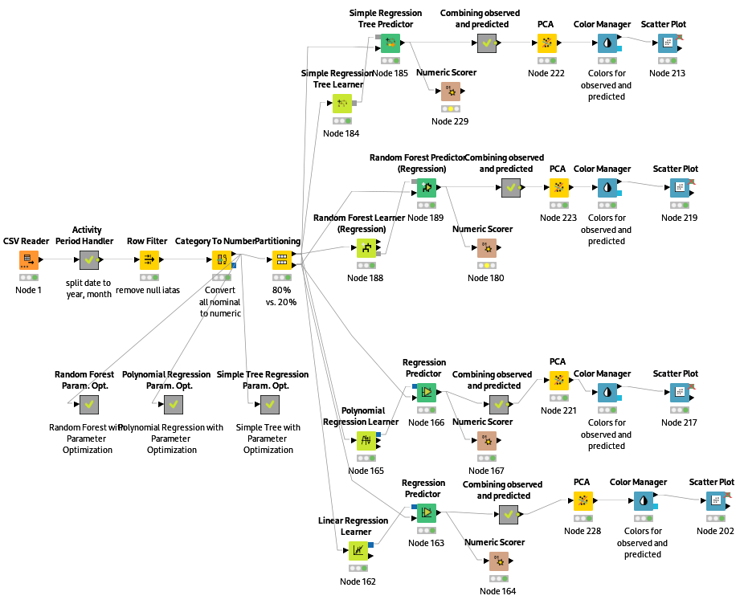
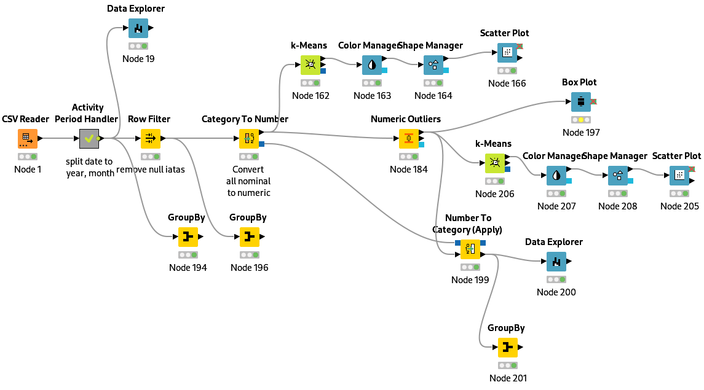

# Data Mining of Air Traffic Passenger Statistics using Knime

This repository contains three Knime workflows that aim to analyze the [Air Traffic Passenger Statistics](https://data.sfgov.org/Transportation/Air-Traffic-Passenger-Statistics/rkru-6vcg) dataset from the **San Francisco International Airport**. The workflows include tasks such as **classification comparison**, **regression analysis**, and **outlier detection**. Each workflow performs some data preprocessing and visualization tasks before applying various machine learning algorithms to the data.

This repository can serve as a starting point for anyone looking to analyze the Air Traffic Passenger Statistics dataset or to explore machine learning techniques using **Knime**.

## Workflow 1: Classification Algorithms Comparison

This workflow compares the performance of three classification algorithms: **Naive Bayes**, **Decision Tree**, and **Random Forest**, on this dataset.
It begins with data preprocessing steps to clean and prepare the data for analysis.

Next, the workflow uses learning curves to determine the optimal hyperparameters for the **Decision Tree** and **Random Forest** models, which helps to improve their accuracy and generalization performance. For **Naive Bayes**, it applies backward feature elimination.

Finally, the workflow performs 10-fold cross-validation for each algorithm and enables the ability to observe and compare their accuracies.

## Workflow 2: Regression Algorithms Comparison

This workflow compares the performance of four regression algorithms: **Linear Regression**, **Polynomial Regression**, **Simple Tree Regression**, and **Random Forest Regression**. It begins with data preprocessing steps to clean and prepare the data for analysis. Next, the workflow uses learning curves to optimize the hyperparameters of the Random Forest, Decision Tree, and Polynomial Regression models. Finally, the workflow compares the performance of the algorithms using numeric scorer nodes and visualizes their predictions using scatter plots.

## Workflow 3: Outliers Detection

This workflow aims to identify potential outliers in the aformentioned dataset. The workflow uses the **Numeric Outliers** node, **Box Plot**, and **Data Explorer** to observe potential outliers in the dataset. It also uses **K-Means** with 4 clusters in passenger count and **Group-By** nodes to further investigate the features of the potential outliers.

## Running the Workflow

To run any of the workflows included in this repository, follow these general steps:

1. Download and install Knime from the official website.
2. Clone or download this repository to your local machine.
3. Open Knime and go to **"File"** > **"Import KNIME Workflow"**.
4. Select the desired workflow file (e.g. **"classification_comparison.knwf"**) from the downloaded repository and click **"Finish"**.
5. Once the workflow is imported, click on **"Execute"** to run the entire workflow or run each node individually to see the intermediate results.

**Note: Before running the workflow, make sure to set the correct file path to the downloaded dataset in the "CSV Reader" node.**
